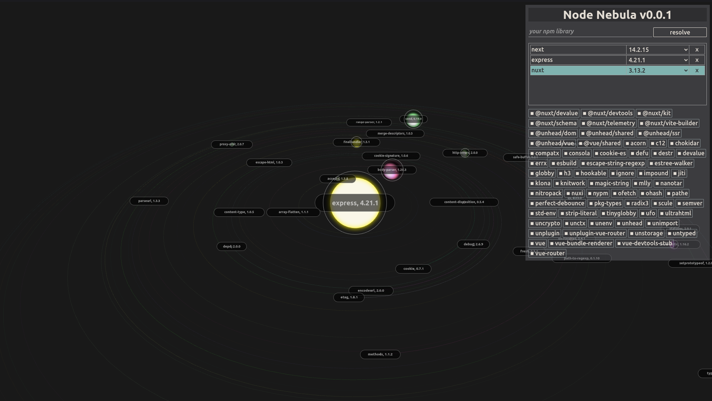
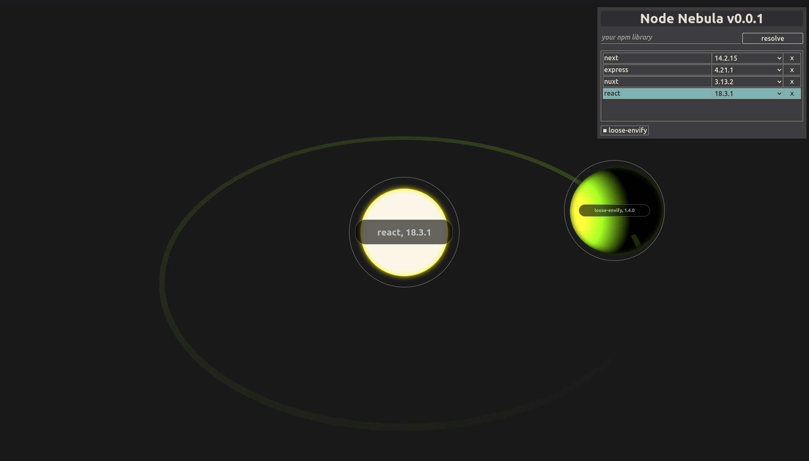
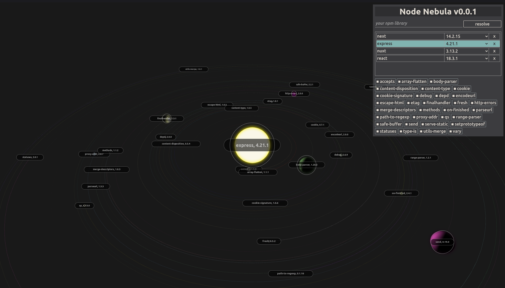
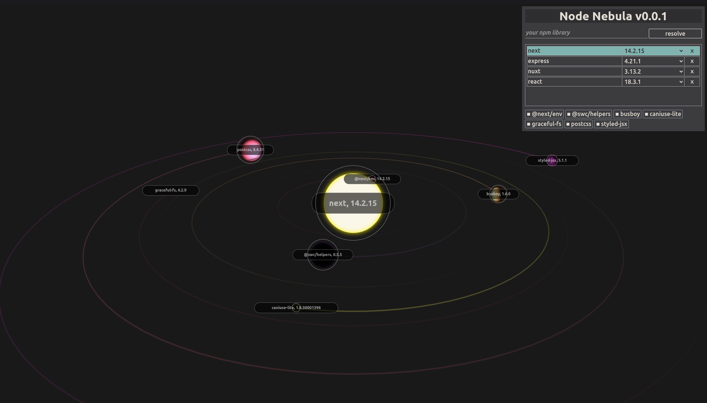

# Node Nebula

This is a (`Go` + `HTMX` + `TypeScript`) personal project. 

The goal is to visualize all the dependencies of `npm` libraries in a nice, user-friendly way.



### 1. Dependencies:

- Go 1.22.5+
- Node v20.17.0+ (might as well work on anything 18+)

### 2. Quick Setup

```
$ cd frontend
$ npm run build
```
  This:
- compiles `.js` files
- starts the server on port `8080`

  That's it. Open the browser at [localhost:8080](http://localhost:8080/)

### 3. Usage:

1. Type in the name of your library. I recommend using existing libraries, I don't know what will happen with `i-dont-know-if-this-library-exists.js`,
2. Press `enter` or `resolve`,
3. You have to manually click the library (list) to load it into the webGL viewer
4. Some libraries have more dependencies than others. `react` with resolve to just one, but `express` to many more. Because resolving is done recursively, this might take some time for huge libraries (try `nuxt`). Only `dependencies` are resolved, `devDependencies` are ignored.
5. Currently, only top level libraries are displayed. Go to `Application > Storage > IndexedDB > PackageManagerDb > libraries` to see that it's actually resolving all dependencies (not top only).
6. You can click on the dependencies (menu) to focus on it's "planet".
7. Expect bugs. Just refresh if something looks bad.


### 4. Limitations:

- Currently only one (`planetary`) visual representation is available.
- Only top level dependencies are displayed
- Developed for desktop only

#### 5. Examples:

`react`


`express`


`next`
